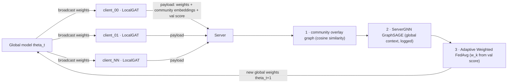
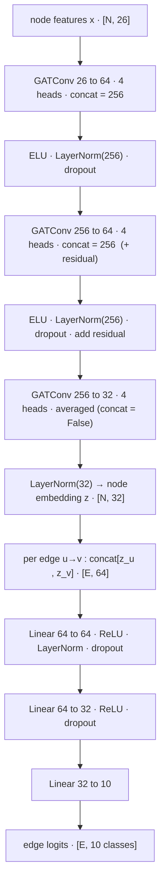
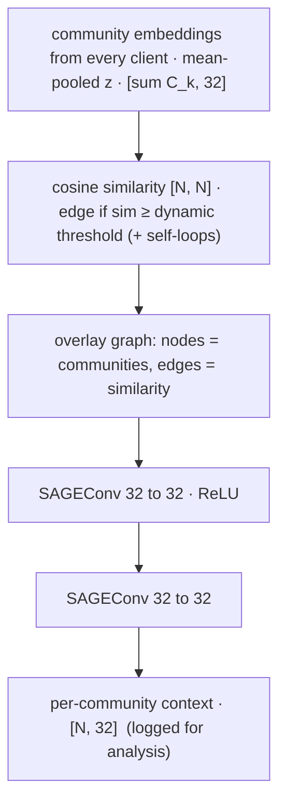

# FedEV-GNN

Federated Graph Neural Networks for Intrusion Detection in Connected Electric Mobility.

The framework models network traffic as a directed multigraph — IP addresses
as nodes, NetFlow records as edges — and trains a Temporal GNN across
federated clients without sharing raw traffic data.

---

## Dataset

**NF-ToN-IoT-v3** — 27.5 M NetFlow records, 9 attack classes + benign.

| Property | Value |
|---|---|
| Source | University of Queensland — ML-Based NIDS Datasets |
| Total flows | 27,520,260 |
| Features | 53 NetFlow features + 2 labels = 55 columns |
| Format | CSV (original) → Parquet (auto-converted on first load) |

Download: https://staff.itee.uq.edu.au/marius/NIDS_datasets/

Place the CSV at:
```
data/raw/NF-ToN-IoT-v3/NF-ToN-IoT-v3.csv
```

---

## Setup

```bash
python -m venv .venv && source .venv/bin/activate
pip install -e ".[eda]"   # core + notebook/vis extras
```

---

## Data Pipeline CLI — `fedgnn-data`

All pipeline stages are driven by a single console script.

```
fedgnn-data <command> [options]
```

Equivalent to `python -m fedgnn.data <command>`.

### Full pipeline (run in order)

```bash
# 1. Draw a 1 M stratified sample from the raw 5.3 GB CSV
fedgnn-data sample --rows 1000000

# 2. Clean the sample and feature enginnering 
fedgnn-data clean

# 3. Validate and write the 44-feature set
fedgnn-data select

# 4. Partition into 8 non-IID federated clients (Dirichlet label-skew)
fedgnn-data split

# 5. Build PyG graphs (static + temporal) for GAT and T-GAT training
fedgnn-data build
```

---

### `load` — inspect any dataset stage

```bash
fedgnn-data load                           # raw dataset
fedgnn-data load --sample                  # latest sample
fedgnn-data load --processed               # latest cleaned parquet
fedgnn-data load --processed --rows 10000  # specific cleaned file
fedgnn-data load --split 3                 # federated client 3
fedgnn-data load --split client_00         # same, by folder name
fedgnn-data load --head 10                 # show 10 preview rows (default 5)
```

Prints: source path · shape · row preview · attack distribution · grouped
feature catalogue (topology / selected features by group / not selected /
class map).

---

### `sample` — stratified subsample

```bash
fedgnn-data sample --rows 1000000          # default
fedgnn-data sample --rows 50000 --seed 0
fedgnn-data sample --rows 1000000 --csv    # also write .csv copy
```

Writes `data/samples/ton_iot_{n}.parquet`. The CSV copy is for inspection
only; the pipeline always reads parquet.

---

### `clean` — non-destructive cleaning

```bash
fedgnn-data clean               # newest sample
fedgnn-data clean --rows 50000  # ton_iot_50000.parquet specifically
```

Steps: drop 0.0.0.0 / self-loops · lowercase Attack · fill nulls · drop
constant columns · add `y_binary` + `y_multiclass` with a global-stable
label map (`benign=0`, attacks alphabetical `1..N`).

**Feature engineering** (also runs here — raw columns are kept, new ones added):

- **One-hot the categories** — `PROTOCOL` → `is_tcp/is_udp/is_icmp`;
  `L7_PROTO` (nDPI app protocol) → top-10 protocols `l7_*` + `l7_other` catch-all
  (~98% covered by the top 10); `L4_DST_PORT` → service buckets
  (`port_http/https/dns/…`). A protocol id isn't a quantity, so we turn it into
  *which-protocol* flags instead of feeding the raw number.
- **Split the TCP flag bitmasks into bits** — `CLIENT/SERVER_TCP_FLAGS` store
  flags summed into one number (18 = SYN+ACK); we break them into one 0/1 column
  per flag (`cf_syn`, `sf_ack`, …) so the model can read each flag.
- **Turn raw counts into ratios** — bytes-per-packet, in/out byte & packet
  asymmetry, retransmission rate, throughput ratio. Ratios separate attacks
  better than raw volumes.
- **Turn packet-size counts into fractions** — `frac_pkt_128/256_512/…`, so the
  shape of the traffic matters, not its size.
- **Add spreads** — `ttl_range`, `pkt_len_range` (max − min).

Writes `data/processed/cleaned_{n}.parquet` + `feature_columns.json` +
`label_map.json`.

---

### `select` — fixed 55-feature set

```bash
fedgnn-data select
```

Validates and writes the domain-driven 55-feature set to
`data/processed/selected_features.json`.

| Group | Count | Purpose |
|---|---|---|
| Protocol | 3 | one-hot transport protocol (TCP/UDP/ICMP) |
| Application (L7) | 11 | one-hot top-10 nDPI app protocols + `l7_other` |
| Service / Port | 5 | destination-port service buckets (http/https/dns/…) |
| TCP State | 10 | decomposed client+server TCP-flag bits |
| Volume | 4 | raw in/out byte & packet counts (log-compressed) |
| Volume Ratios | 7 | asymmetry, retransmission rate, throughput, duration |
| Packet Size | 6 | per-size-bucket fractions + packet-length spread |
| Temporal | 6 | flow duration, duration ratio, inter-arrival timing |
| Reachability (TTL) | 3 | TTL min/max and hop-count spread |

---

### `split` — federated partitioning

```bash
fedgnn-data split                     # dirichlet label-skew, 8 clients, alpha=0.5 (default)
fedgnn-data split --alpha 0.1         # sharper skew (more non-IID)
fedgnn-data split --strategy threat   # one-attack-per-client segments
fedgnn-data split --strategy hub      # traffic-ranked hubs (near-IID)
```

**Three strategies:**

- **`dirichlet`** *(default, non-IID — recommended)* — the standard FL label-skew
  benchmark. For every class, a `Dirichlet(alpha)` draw decides how its flows split
  across clients, so **every client sees all classes but in very different
  proportions** (each is dominant in a few, sparse in others). `alpha` is the
  heterogeneity knob: `→0` ≈ one-class-per-client, `0.5` moderate (default), `→∞`
  IID. Unlike `threat`, every client can learn a real multi-class model, so FedAvg
  actually converges. Lives in `federated_split/dirichlet_splitter.py`.
- **`threat`** *(extreme skew, EV narrative)* — 8 EV network segments, each a client
  with a role and a signature attack class; each attack class goes to exactly one
  segment. Maximally non-IID and on-narrative, but clients can't learn classes they
  never see — good for illustrating the *problem*, not for a converging model.
- **`hub`** *(near-IID, baseline)* — scores every IP by `src_flows + dst_flows`,
  takes the top-N as hub anchors, assigns each flow to the hub it talks to most.
  Similar attack mix per client — handy as an IID comparison point.

so the partition of the **threat** is :

| Client | Segment role | Signature threat(s) |
|---|---|---|
| client_00 | `charging_controllers` | ddos |
| client_01 | `charging_gateways` | dos |
| client_02 | `vehicle_telematics` | scanning |
| client_03 | `ocpp_backend` | password, injection |
| client_04 | `driver_mobile_app` | xss |
| client_05 | `v2g_comms_link` | mitm |
| client_06 | `firmware_ota` | backdoor, ransomware |
| client_07 | `field_benign_edge` | benign only |

Benign traffic (~60%) is spread as an equal baseline + load-balancing
background, so every segment can still learn benign-vs-attack and client sizes
stay comparable. **Heterogeneity introduced:** *label skew* (each attack class
owned by exactly one client; most clients miss most classes) and *quantity
skew* (segment size tracks its threat volume). The shared 10-class label space
keeps FedAvg aligned; the per-client inverse-frequency loss handles absent
classes. Roles live in `ROLE_PROFILES` (`federated_split/threat_splitter.py`).

Writes one folder per client:

```
data/clients/
  client_00/  flows.parquet  [flows.csv]  meta.json
  client_01/  ...
  manifest.json
```

Each `meta.json` records flow count, unique src/dst count, and per-class
distribution — plus, for `threat`, the segment `role`, its `signature_attacks`,
and `attack_ratio`; for `hub`, the hub IP and traffic score.

---

### `build` — PyG graph construction for GNN and T-GNN

```bash
fedgnn-data build                       # all clients, 1-hour snapshot windows
fedgnn-data build --window-ms 1800000   # 30-minute windows
fedgnn-data build --n-clients 2         # only the first 2 clients (debug)
```

> Requires the `gnn` extra: `pip install -e ".[gnn]"` (`torch`,
> `torch-geometric`, `scipy`). Every other `fedgnn-data` command works
> without it; `build` exits with an install hint if it's missing.

Turns each client's `flows.parquet` into the PyG graphs T-GAT trains on.
**Nodes = unique device IPs, edges = flows** — a normal communication graph;
the only "temporal" twist is that flows are bucketed by
`FLOW_START_MILLISECONDS` into fixed-width windows and **one graph snapshot
is built per window**, because T-GAT needs that ordered sequence to learn how
the graph evolves, not just a single frozen view.

Each snapshot is a `torch_geometric.data.Data` with `x` (the 55 selected
features, mean-aggregated over each node's incident in+out flows), `edge_index`,
`edge_attr` (the same 55 features kept per-edge), and `y` (`y_multiclass`).

Writes, alongside each client's `flows.parquet`:

| File | Contents |
|---|---|
| `graph.pt` | one whole-client static `Data` graph — training-ready single graph |
| `graphs.pt` | ordered `list[Data]` snapshot sequence — what T-GAT unrolls over |
| `graph.mat` | the same static graph as `graph.pt`, mirrored to `.mat` for MATLAB/Octave/scipy inspection |
| `graph_meta.json` | `graph` block (static-graph nodes/edges/class distribution, the one you'll likely read first) + `temporal` block (sequence stats) |

It also prints — and writes to `data/clients/gat_param_count.json` (shared by every
client, since the architecture doesn't vary per client) — the parameter count of
the local **GAT** actually trained (`fedgnn.train.client.LocalGAT`, a normal
non-temporal GAT) with a `convs / norms / classifier` breakdown matching
`fedgnn-monitor`: the default `26 → 64×4` encoder over 3 GAT layers + a 3-layer edge
MLP → **114,570** params. (Tune it with the `fedgnn-train` / `fedgnn-monitor`
`--hidden/--heads/--layers/--embed_dim` flags.)

---

## Training CLI — `fedgnn-train`

Runs the federated simulation over the `data/clients/*` graphs: every round each
client trains its local GAT, the server fuses them with Adaptive Weighted FedAvg,
and the global model is evaluated. Each run is isolated in its own experiment folder
so nothing is overwritten.

```bash
pip install -e ".[gnn]"        # torch + torch-geometric (one-time)
```

### Quick start

```bash
# Smoke test first — 3 clients, 2 rounds (finishes in seconds)
fedgnn-train run --rounds 2 --local_epochs 1 --n_clients 3

# A real run — all clients, auto-named experiment_001 (next run -> experiment_002)
fedgnn-train run --rounds 50 --local_epochs 5
```

That's it. When it finishes, render the figures with
`fedgnn-validate plot` (below).

### Common variants

```bash
fedgnn-train run --rounds 50 --experiment my_run     # name the run
fedgnn-train run --rounds 80 --resume                # continue the latest run
fedgnn-train run --rounds 50 --cpu                   # force CPU (no GPU needed)
fedgnn-train run --rounds 50 --metric macro_attack_recall   # optimise attack recall
fedgnn-train run --rounds 50 --hidden 128 --heads 8 --layers 4   # a bigger model
```

Stop any time with **Ctrl-C** — progress is saved; pick it up with `--resume`.

### The flags you'll actually touch

| flag | default | what it does |
|---|---|---|
| `--rounds` | `50` | number of federated rounds |
| `--local_epochs` | `5` | local epochs per client per round |
| `--experiment` | auto | name the run (else `experiment_NNN`) |
| `--resume` | off | continue the latest (or `--experiment`) run |
| `--n_clients` | all | use only the first N clients (quick tests) |
| `--metric` | `balanced_accuracy` | best-model + aggregation metric (`macro_attack_recall`, `macro_f1`, …) |
| `--split` | `stratified` | edge split (keeps every class in train/val/test) |
| `--cpu` | off | force CPU even if CUDA exists |
| `--quiet` | off | print only the per-round summary |

Run `fedgnn-train run --help` for the full list (architecture, learning rate,
FedAvg `--alpha`, overlay thresholds, …). Outputs land in `Models/<exp>/`
(checkpoints) and `Results/<exp>/` (per-round metrics, resources, `metadata.json`,
and `test_results.json`). Full reference: [docs/train-pipeline.md](docs/train-pipeline.md).

---

## Validation CLI — `fedgnn-validate`

Turns the JSON a training run leaves under `Results/<exp>/` into evaluation
**figures** under `Figures/<exp>/` — loss curves per client, bar charts of how
good each client and the global (server) model are, and the global-metric /
aggregation-weight evolution. Read-only: it re-draws what training recorded, never
re-runs a model, so it works on a finished *or* interrupted run.

```bash
pip install -e ".[viz]"        # matplotlib

fedgnn-validate list                       # show available experiments
fedgnn-validate plot                       # latest experiment -> Figures/<latest>/
fedgnn-validate plot fedgnn05              # a specific experiment
fedgnn-validate plot --all                 # every experiment under Results/
fedgnn-validate plot fedgnn02 --format pdf --dpi 200 --verbose
```

Output per experiment `<exp>`:

```
Figures/<exp>/
├── loss_all_clients.png               every client's training loss, overlaid
├── client_quality.png                 grouped bars — how good each client is
├── clients/
│   ├── client_NN_loss.png             one client's loss curve
│   ├── client_NN_metrics.png          its local-vs-global metric trends
│   ├── client_NN_confusion.png        per-client multiclass confusion matrix
│   └── client_NN_confusion_binary.png per-client benign-vs-attack (2×2)
└── server/
    ├── global_metrics_evolution.png   the four headline metrics per round
    ├── server_quality.png             bars — how good the global model is
    ├── aggregation_weights.png        each client's FedAvg weight share per round
    ├── confusion.png                  global multiclass confusion matrix
    └── confusion_binary.png           global benign-vs-attack confusion matrix
```

Quality bars use the held-out **test** metrics when present, and fall back to the
last-round **global** metrics for an interrupted run (noted in the title).
Confusion matrices come from the stored test report; runs trained before CMs were
recorded are recomputed on the fly (needs the `gnn` extra). See
[docs/validation-pipeline.md](docs/validation-pipeline.md) for the full reference.

---

## Monitoring CLI — `fedgnn-monitor`

Profiles the **per-client resource cost** of a run — how much **RAM** each client
needs (peak host memory, and peak GPU memory on CUDA), its **compute** (FLOPs per
epoch / round), and the **model size** (parameters, per-module breakdown). It
builds each client and runs one real training step; the architecture flags mirror
`fedgnn-train run`, so you can size a candidate model before training.

```bash
pip install -e ".[gnn]"        # torch + torch-geometric

fedgnn-monitor profile                     # all clients, default architecture
fedgnn-monitor profile --cpu               # force CPU (reports host-RAM peaks)
fedgnn-monitor profile --client 0          # one client (clean absolute RAM)
fedgnn-monitor profile --hidden 128 --heads 8 --layers 4   # size a bigger model
fedgnn-monitor profile --json monitor.json # also dump the raw report
```

It prints the shared model architecture + parameter breakdown once, then a
per-client table (graph size, RAM peak, FLOPs/epoch, FLOPs/round) with a
federation TOTAL/PEAK footer. See [docs/monitoring.md](docs/monitoring.md).

---

## Model Architecture

Two models, mirroring the federated topology: a **local GAT** on every client
(edge/flow classifier) and a **server GNN** that reasons over a community-overlay
graph. The diagrams below are rendered by GitHub/VSCode (Mermaid) and reflect the
default config (`26` features → `64`/head × `4` heads, `3` GAT layers,
`embed_dim=32`, `10` classes).

### Federated round (system view)



### Local model — `LocalGAT` (client.py, ~114.6 k params)

A deep, multi-head, residual **GAT encoder** turns the client graph into node
embeddings; an **edge MLP** classifies each flow from its two endpoint embeddings.



> The middle residual block repeats `num_layers - 2` times (1× at the default
> `--layers 3`). Param split: `convs` 106,784 · `norms` 1,088 · `classifier` 6,698.
> The `embed_dim=32` node vector `z` is **both** the classifier input **and** the
> per-community fingerprint sent to the server (so it is shared with `ServerGNN`).

### Server model — overlay graph + `ServerGNN` (server.py)

The server never sees raw flows. Each client mean-pools `z` per Louvain community
and uploads those vectors; the server links similar communities into an overlay
graph and runs a 2-layer **GraphSAGE** over it for global context.



> The overlay **threshold is dynamic** — it starts high (sparse) and is lowered
> only while some community is isolated, down to a floor. The `ServerGNN` context
> is a representation/telemetry signal; the actual weight fusion is done by
> **Adaptive Weighted FedAvg** (`w_k` from each client's validation score), which
> keeps aggregation in strict FedAvg compliance. Full write-up:
> [docs/train-pipeline.md](docs/train-pipeline.md).

---

## Output Layout

```
data/
├── raw/NF-ToN-IoT-v3/
│   └── NF-ToN-IoT-v3.csv          ← download manually
├── samples/
│   └── ton_iot_1000000.parquet     ← fedgnn-data sample
├── processed/
│   ├── cleaned_1000000.parquet     ← fedgnn-data clean
│   ├── feature_columns.json        ← all 48 edge features
│   ├── label_map.json              ← class → index (shared)
│   └── selected_features.json      ← fixed 26-feature subset
└── clients/
    ├── client_00/                  ← fedgnn-data split (+ build)
    │   ├── flows.parquet
    │   ├── meta.json
    │   ├── graph.pt                ← fedgnn-data build (whole-client static graph)
    │   ├── graphs.pt               ← fedgnn-data build (temporal snapshot sequence)
    │   ├── graph.mat               ← fedgnn-data build (same static graph, .mat)
    │   └── graph_meta.json         ← fedgnn-data build
    ├── ...
    ├── gat_param_count.json        ← fedgnn-data build (LocalGAT size, shared by all)
    └── manifest.json
```

---

## Python API

```python
from fedgnn.data.loaders import ToNIoTLoader

# Load full dataset lazily
loader = ToNIoTLoader()
lf = loader.load()                              # Polars LazyFrame

# Load latest sample
loader = ToNIoTLoader(sample=True)
lf = loader.load(nrows=100_000, stratify=True)
df = lf.collect()
```

```python
from fedgnn.data.preprocessing.cleaning import clean
from fedgnn.data.preprocessing.feature_selection import SELECTED, GROUPS
from fedgnn.data.federated_split.hub_splitter import compute_hub_scores, partition
```

```python
# Requires the `gnn` extra (torch, torch-geometric, scipy)
from fedgnn.data.graph_builder import build_snapshot, build_snapshot_sequence

import torch
graph = torch.load("data/clients/client_00/graph.pt", weights_only=False)
sequence = torch.load("data/clients/client_00/graphs.pt", weights_only=False)
```

---

## Package Structure

```
src/fedgnn/
├── data/
│   ├── loaders/            ToNIoTLoader (Polars lazy/streaming)
│   ├── preprocessing/      cleaning.py · feature_selection.py
│   ├── graph_builder/      edge_graph.py · temporal_graph.py
│   ├── federated_split/    hub_splitter.py
│   └── cli.py              fedgnn-data entry point
├── train/                 federated FedAvg simulation (fedgnn-train)
├── evaluation/            metrics · evaluator · FLOPs · confusion matrix
├── validation/            results → figures (fedgnn-validate)
│   ├── loader.py          re-assembles Results/<exp>/ into ExperimentResults
│   ├── plots.py           loss curves · quality bars · server dynamics · confusion
│   ├── confusion.py       recompute CMs for legacy runs (replay inference)
│   └── cli.py             fedgnn-validate entry point
└── monitor/               per-client resource profiling (fedgnn-monitor)
    ├── profiler.py        RAM (host+GPU) · FLOPs · model size per client
    └── cli.py             fedgnn-monitor entry point
```

---

## Development

```bash
pip install -e ".[dev]"
```

Pipeline documentation:
[docs/data_pipeline.md](docs/data_pipeline.md) ·
[docs/train-pipeline.md](docs/train-pipeline.md) ·
[docs/validation-pipeline.md](docs/validation-pipeline.md) ·
[docs/monitoring.md](docs/monitoring.md)
